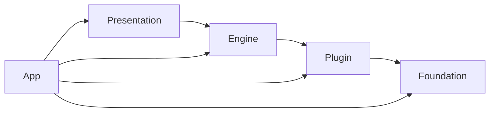
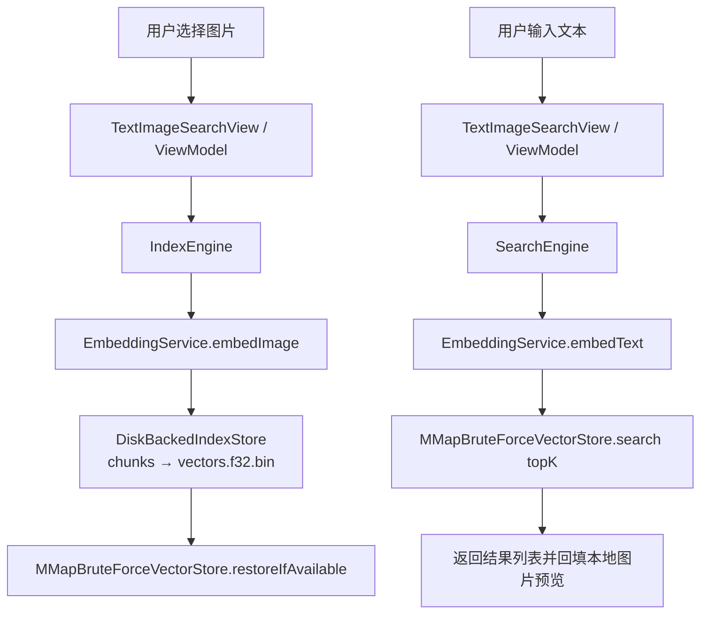

# 架构设计

> 本文档记录 `PhotoScanner` 当前已经落地的工程分层、依赖规则、核心边界与主数据链路。  
> 只描述稳定事实，不展开性能专项和未来规划细节。

## 分层结构



依赖严格单向，不允许反向引用；`App/` 只负责组装与注入，不承载业务逻辑。

| 层 | 目录 | 职责 | 关键约束 |
|----|------|------|---------|
| **Foundation** | `Foundation/` | 错误定义、日志、资源定位 | 不依赖任何上层 |
| **Plugin** | `Plugin/` | 模型推理实现、预处理、tokenizer | ONNX Runtime 只在这一层出现 |
| **Engine** | `Engine/` | embedding、相似度、索引构建、搜索编排 | 只依赖 `ModelPlugin` 协议，不关心底层实现 |
| **Presentation** | `Presentation/` | UI 视图、ViewModel、用户交互状态 | 只依赖 Engine / App 注入服务 |
| **App** | `App/` | Composition Root、Environment 注入 | 唯一允许跨层接线的地方 |

## 当前文件索引

```text
PhotoScanner/
├── App/
│   ├── AppServices.swift                         # 服务引用聚合
│   └── Environment+Services.swift                # EnvironmentKey 注入
├── Foundation/
│   ├── Errors.swift                              # PSError 统一错误枚举
│   ├── Logger.swift                              # OSLog 按模块分类
│   └── BundleResource.swift                      # Bundle 资源定位 + 资源指纹
├── Plugin/
│   ├── ModelPlugin.swift                         # ★ 核心模型协议
│   ├── EmptyModelPlugin.swift                    # Fallback / Preview
│   └── ChineseCLIP/
│       ├── ChineseCLIPPlugin.swift               # ONNX 双塔实现
│       ├── ChineseCLIPTokenizer.swift            # Bert WordPiece tokenizer
│       └── ChineseCLIPImagePreprocessor.swift    # 图像 Resize + Normalize
├── Engine/
│   ├── EmbeddingService.swift                    # embedding 统一门面 (actor)
│   ├── SimilarityEngine.swift                    # 图文相似度计算
│   ├── SearchEngine.swift                        # 文搜图编排入口
│   └── Indexing/
│       ├── IndexManifest.swift                   # 索引头 / 模型兼容性元信息
│       ├── IndexEntry.swift                      # 单条 embedding 记录
│       ├── IndexSnapshot.swift                   # manifest + entries 聚合
│       ├── IndexBuildState.swift                 # 构建状态模型
│       ├── IndexCheckpoint.swift                 # 构建恢复 checkpoint
│       ├── IndexImportedAsset.swift              # 导入图片元信息 / 本地标识
│       ├── IndexBinaryFormat.swift               # vectors.f32.bin 编解码
│       ├── IndexStore.swift                      # 索引持久化边界协议
│       ├── DiskBackedIndexStore.swift            # 磁盘索引实现
│       ├── VectorStore.swift                     # 向量检索边界协议
│       ├── BruteForceVectorStore.swift           # 内存版暴力检索实现
│       ├── MMapBruteForceVectorStore.swift       # mmap + Float32 精确检索实现
│       └── IndexEngine.swift                     # 索引构建 / 恢复编排入口
├── Presentation/
│   ├── SimilarityDebug/
│   │   ├── SimilarityDebugView.swift             # 图文相似度验证页
│   │   └── SimilarityDebugViewModel.swift        # 验证页状态
│   └── TextSearch/
│       ├── TextImageSearchView.swift             # 最小文搜图页面
│       └── TextImageSearchViewModel.swift        # 文搜图状态与交互编排
├── ContentView.swift                             # 首页 Tab 路由
└── PhotoScannerApp.swift                         # Composition Root
```

## 核心边界

### 1. `ModelPlugin`

`ModelPlugin` 是连接 `Engine` 和 `Plugin` 的唯一桥梁：

```swift
protocol ModelPlugin: Sendable {
    var descriptor: ModelDescriptor { get }
    func load() async throws
    func unload() async
    func encodeImage(_ imageData: Data) async throws -> [Float]
    func encodeText(_ text: String) async throws -> [Float]
}
```

设计约束：

- 接口只接收原始输入（`Data` / `String`）
- 输出为**未归一化**的 embedding，L2 归一化由 `EmbeddingService` 统一处理
- 模型常量（mean / std / context length）封装在具体实现内部

### 2. `IndexStore`

`IndexStore` 负责索引文件的持久化与恢复，不负责检索算法。

当前已落地实现为 `DiskBackedIndexStore`，负责：

- `manifest.json`
- `checkpoint.json`
- `chunks/`
- `vectors.f32.bin`
- 导入图片 sidecar 数据

### 3. `VectorStore`

`VectorStore` 负责向量检索能力，不负责 embedding 生成与磁盘文件组织。

当前工程同时保留两种实现：

- `BruteForceVectorStore`：内存版基线
- `MMapBruteForceVectorStore`：`mmap + Float32` 精确检索主实现

### 4. `IndexEngine` / `SearchEngine`

职责拆分如下：

- **`IndexEngine`**：负责“图片 → embedding → 索引落盘 / 恢复加载”
- **`SearchEngine`**：负责“文本 → query embedding → 向量检索 → 返回结果”

两者都复用 `EmbeddingService`，但分别服务构建链路与查询链路。

## 并发模型

| 类型 | 隔离方式 | 理由 |
|------|---------|------|
| `ChineseCLIPPlugin` | actor | 持有 ORT Session 等可变状态 |
| `EmbeddingService` | actor | 持有 plugin 引用与 ready 状态 |
| `DiskBackedIndexStore` | actor | 管理磁盘索引状态与文件读写 |
| `MMapBruteForceVectorStore` | actor | 管理已加载的 manifest / mmap 数据 |
| `IndexEngine` | actor | 编排构建、恢复与落盘过程 |
| `SimilarityEngine` | `Sendable` class | 无持久可变状态，负责图文相似度计算 |
| `SearchEngine` | `Sendable` class | 无持久可变状态，负责文搜图编排 |
| `SimilarityDebugViewModel` | `@Observable @MainActor` | UI 状态 |
| `TextImageSearchViewModel` | `@Observable @MainActor` | UI 状态 |

## 依赖注入

采用 **Composition Root + EnvironmentKey** 模式：

1. `PhotoScannerApp.init()` 统一组装 `Plugin → Engine → Services`
2. `AppServices` 只保存服务引用，不含业务逻辑
3. 通过 `.environment(\.services, services)` 注入视图树
4. 页面通过 `@Environment(\.services)` 获取依赖

当前注入的核心服务包括：

- `EmbeddingService`
- `SimilarityEngine`
- `DiskBackedIndexStore`
- `MMapBruteForceVectorStore`
- `IndexEngine`
- `SearchEngine`

## 当前主数据链路

### 1. 最小文搜图主链路

当前首页主入口已经是**最小文搜图闭环**：



### 2. 查询阶段的稳定原则

对于**已经建立索引的图片**，查询阶段默认遵循以下原则：

- **先通过图片标识定位已索引向量**
- **直接使用已索引向量参与相似度 / 检索计算**
- **不在查询主路径中重新读取图片数据并重复计算 embedding**

也就是说，图片 embedding 属于**构建阶段产物**，不是查询阶段的常规工作。

### 3. 当前真实资产接入方式

当前最小闭环里，真实图库相关链路已经改为：

- **导入阶段优先保存 `PhotosPicker` 提供的真实 `PhotoKit` 资产标识**
- **索引构建阶段优先读取真实 `PhotoKit` 图片数据；当系统相册不可访问或资源失效时，再回退到本地导入图片 sidecar 缓存**
- **结果展示阶段优先回填系统相册缩略图与文件名；读取失败时继续回退到本地 sidecar 数据**

也就是说，当前真实资产链路已经进入“**`PhotoKit` 主路径、sidecar 兜底**”的混合阶段。

## 当前状态说明

当前工程已经同时具备两条已落地链路：

- **图文相似度验证链路**：`SimilarityDebugView` → `SimilarityEngine`
- **最小文搜图链路**：`TextImageSearchView` → `IndexEngine` / `SearchEngine`

其中：

- `SimilarityDebugView` 的定位是**内部验证台**
- `TextImageSearchView` 的定位是**当前主产品入口**

## 当前不写入 context 的内容

以下内容仍保留在 `docs/topics/`，不放入 `context/`：

- `HNSW` 是否引入及其条件
- `SQLite` / segment / shard 方案取舍
- 性能指标目标与阶段计划
- 更大规模图库下的演进路线

这些内容仍属于**专项设计与阶段性决策**，不是当前稳定事实。
