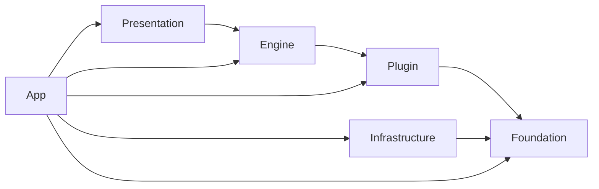
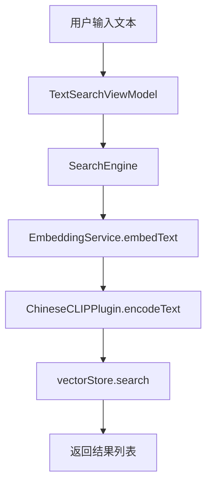
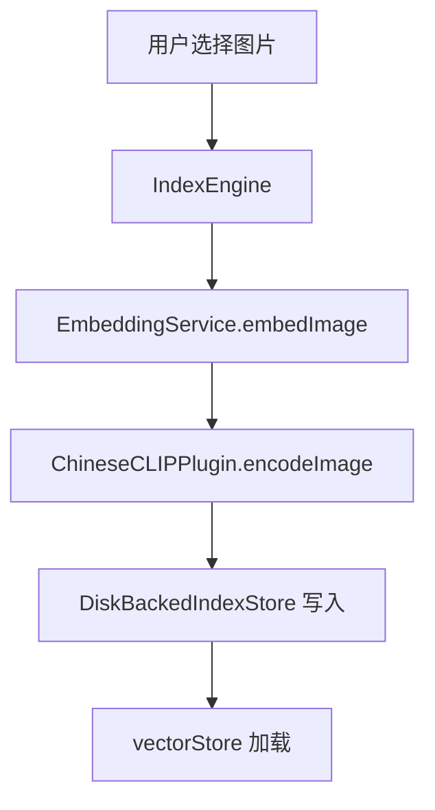

# 架构设计

> 本文档记录 `PhotoScanner` 当前工程分层、依赖规则、核心边界与主数据链路。  
> 只描述稳定事实，标注待改进项（TODO）。

## 分层结构



依赖严格单向，不允许反向引用；`App/` 只负责组装与注入，不承载业务逻辑。

| 层 | 目录 | 职责 | 关键约束 |
|----|------|------|---------|
| **Foundation** | `Foundation/` | 基础类型、错误、日志、工具 | 纯 Swift，零外部依赖 |
| **Plugin** | `Plugin/` | 模型推理、预处理、tokenizer | ONNX Runtime 只在此层 |
| **Engine** | `Engine/` | embedding、相似度、索引、搜索 | 只依赖协议，不依赖实现 |
| **Infrastructure** | `Infrastructure/` | 缓存、监控、系统工具 | 可依赖 Foundation |
| **Presentation** | `Presentation/` | UI、ViewModel、交互 | 只通过注入获取服务 |
| **App** | `App/` | Composition Root、依赖注入 | 唯一允许跨层接线 |

### 架构红线

> 违反以下规则会导致架构腐化

1. **Foundation 层**：禁止 import `UIKit`、`Photos`、`CoreLocation`、`Vision`、`CoreML`、`ONNX`
2. **Engine 层**：禁止直接调用 `FileManager`、`PHAsset.fetchAssets` 等基础设施 API
3. **Presentation 层**：禁止执行文件 I/O 或网络操作
4. **所有层**：禁止新增 `.shared` 单例，必须通过构造器注入协议

## 核心边界

### 1. `ModelPlugin`

连接 `Engine` 和 `Plugin` 的唯一桥梁：

```swift
protocol ModelPlugin: Sendable {
    var descriptor: ModelDescriptor { get }
    func load() async throws
    func unload() async
    func encodeImage(_ imageData: Data) async throws -> [Float]
    func encodeText(_ text: String) async throws -> [Float]
}
```

- 接口只接收原始输入（`Data` / `String`）
- 输出为**未归一化** embedding，L2 归一化由 `EmbeddingService` 统一处理
- 模型常量封装在具体实现内部

### 2. `IndexStore`

负责索引文件持久化，不负责检索算法：

- `manifest.json` — 索引元数据
- `checkpoint.json` — 断点续传状态
- `chunks/` — 临时 chunk 文件
- `vectors.f32.bin` — 向量主文件

### 3. `VectorStore`

负责向量检索，当前实现：

- `MMapBruteForceVectorStore` — mmap + Float32 精确检索（主实现）
- `BruteForceVectorStore` — 内存版基线
- `HNSWVectorStore` — HNSW 近似检索（待启用）

### 4. `IndexEngine` / `SearchEngine`

| 引擎 | 职责 | 类型 |
|------|------|------|
| `IndexEngine` | 图片 → embedding → 索引落盘 | actor |
| `SearchEngine` | 文本 → query embedding → 向量检索 | Sendable class |

两者复用 `EmbeddingService`，分别服务构建链路与查询链路。

## 并发模型

| 类型 | 隔离方式 | 说明 |
|------|---------|------|
| `ChineseCLIPPlugin` | actor | ORT Session 可变状态 |
| `EmbeddingService` | actor | plugin 引用与 ready 状态 |
| `DiskBackedIndexStore` | actor | 磁盘索引状态 |
| `MMapBruteForceVectorStore` | actor | manifest / mmap 数据 |
| `HNSWVectorStore` | actor | HNSW 索引包装 |
| `IndexEngine` | actor | 构建编排 |
| `SearchEngine` | Sendable class | 无持久可变状态 |
| `*ViewModel` | `@Observable @MainActor` | UI 状态 |

### 待改进项（TODO）

- `HNSWIndex` 使用 `@unchecked Sendable`，需评估改为 actor 或完全封装
- `SearchEngine` 可考虑改为 actor，与 `IndexEngine` 保持一致

## 依赖注入

**Composition Root + EnvironmentKey** 模式：

1. `PhotoScannerApp.init()` 组装 `Plugin → Engine → Services`
2. `AppServices` 只保存服务引用，不含业务逻辑
3. 通过 `.environment(\.services, services)` 注入视图树
4. 页面通过 `@Environment(\.services)` 获取依赖

注入的核心服务：

```swift
struct AppServices {
    let embeddingService: EmbeddingService
    let similarityEngine: SimilarityEngine
    let indexStore: DiskBackedIndexStore
    let vectorStore: any VectorStore
    let indexEngine: IndexEngine
    let searchEngine: SearchEngine
    let thumbnailCache: ThumbnailCache
    let searchHistoryManager: SearchHistoryManager
}
```

## 主数据链路

### 文搜图链路



### 索引构建链路



## 当前文件索引

```
PhotoScanner/
├── App/
│   ├── AppServices.swift                    # 服务聚合
│   └── Environment+Services.swift           # EnvironmentKey
├── Foundation/
│   ├── Embedding.swift                      # 向量值对象
│   ├── SimilarityScore.swift                # 相似度分数
│   ├── ResourceBudget.swift                 # 资源预算
│   ├── PSError.swift                        # 错误定义
│   ├── Logger.swift                         # 日志门面
│   ├── SearchHistoryManager.swift           # 搜索历史
│   ├── SimdUtils.swift                      # vDSP 工具
│   └── PhotoLibraryAssetProvider.swift      # 相册访问（TODO: 移至 Infrastructure）
├── Plugin/
│   ├── ModelPlugin.swift                    # 模型协议
│   ├── EmptyModelPlugin.swift               # Fallback
│   └── ChineseCLIP/
│       ├── ChineseCLIPPlugin.swift          # ONNX 实现
│       ├── ChineseCLIPTokenizer.swift       # WordPiece 分词
│       └── ChineseCLIPImagePreprocessor.swift # 图像预处理
├── Engine/
│   ├── EmbeddingService.swift               # embedding 门面
│   ├── SimilarityEngine.swift               # 相似度计算
│   ├── SearchEngine.swift                   # 搜索编排
│   └── Indexing/
│       ├── IndexManifest.swift              # 索引元数据
│       ├── IndexSnapshot.swift              # 快照聚合
│       ├── IndexEngine.swift                # 构建编排
│       ├── DiskBackedIndexStore.swift       # 磁盘存储（TODO: FileManager 抽象）
│       ├── MMapBruteForceVectorStore.swift  # mmap 检索（TODO: FileManager 抽象）
│       ├── HNSWVectorStore.swift            # HNSW 包装
│       └── HNSWIndex.swift                  # HNSW 核心（TODO: @unchecked Sendable）
├── Infrastructure/
│   ├── Cache/
│   │   ├── EmbeddingCache.swift             # 双级缓存
│   │   └── ThumbnailCache.swift             # 缩略图缓存（TODO: preload 竞态）
│   ├── System/
│   │   ├── ThermalThrottler.swift           # 热管理
│   │   └── MemoryMonitor.swift              # 内存监控
│   └── Performance/
│       ├── RuntimePerformanceStore.swift    # 性能观测
│       └── ANECompatibilityChecker.swift    # ANE 检测
└── Presentation/
    ├── TextSearch/
    │   ├── TextImageSearchView.swift
    │   └── TextImageSearchViewModel.swift
    └── Components/
        └── ...
```

## 当前状态说明

已落地链路：

- **图文相似度验证**：`SimilarityDebugView` → `SimilarityEngine`
- **最小文搜图**：`TextImageSearchView` → `IndexEngine` / `SearchEngine`
- **真实资产接入**：`PhotoKit` 主路径 + sidecar 兜底

主产品入口：`TextImageSearchView`
